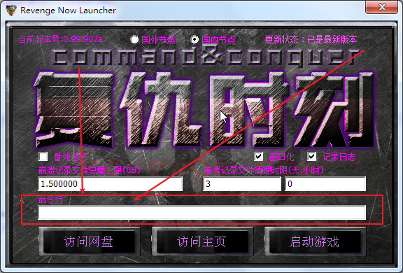

[返回首页](/index.md)

***

## 命令要输入到哪里？:id=Control-code1

- 启动位于复仇时刻根目录的**launcher.exe**（复仇时刻启动器），在"命令行"对话框中输入命令即可，如图所示：  

## 有哪些命令可以输入？

- <kbd>-forcedump</kbd>，在游戏crash的时候会固定生成dump文件，防止玩家忘记保存dump文件  

- <kbd>-cd</kbd>，免cd，启动游戏时已默认添加，可不添加  

***
[返回目录](/QuestionNAnswer/index.md#gaming-problem)