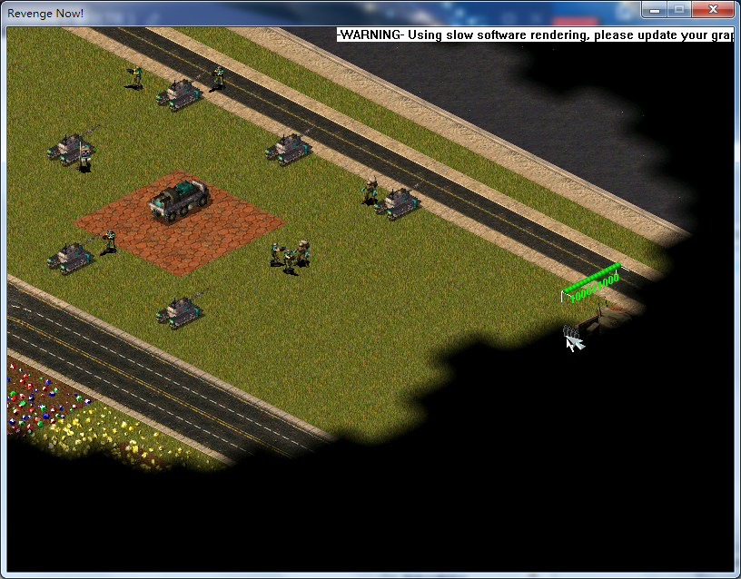

[返回首页](/index.md)

***

- 若游戏内显示 **-WARNING- Using slow software rendering,please update your graphics card driver** ，并且如上图所示游戏画面缺失的用户，请**在游戏内按下两次**<kbd>Alt</kbd>+<kbd>Enter</kbd>，即可解决此问题

!> 若上述操作无法解决此问题，请更新你的显卡驱动。若更新显卡驱动后仍无法解决此问题，请联系复仇时刻群客服或管理员寻求帮助

!> 大部分用户造成此问题的原因是在游戏读取时使用了<kbd>win</kbd>+<kbd>D</kbd>（显示桌面）或者切屏到其他应用程序窗口上了。如果你有其他触发该问题的方法，请联系复仇时刻群客服或管理员

***
[返回目录](/QuestionNAnswer/index.md#gaming-problem)