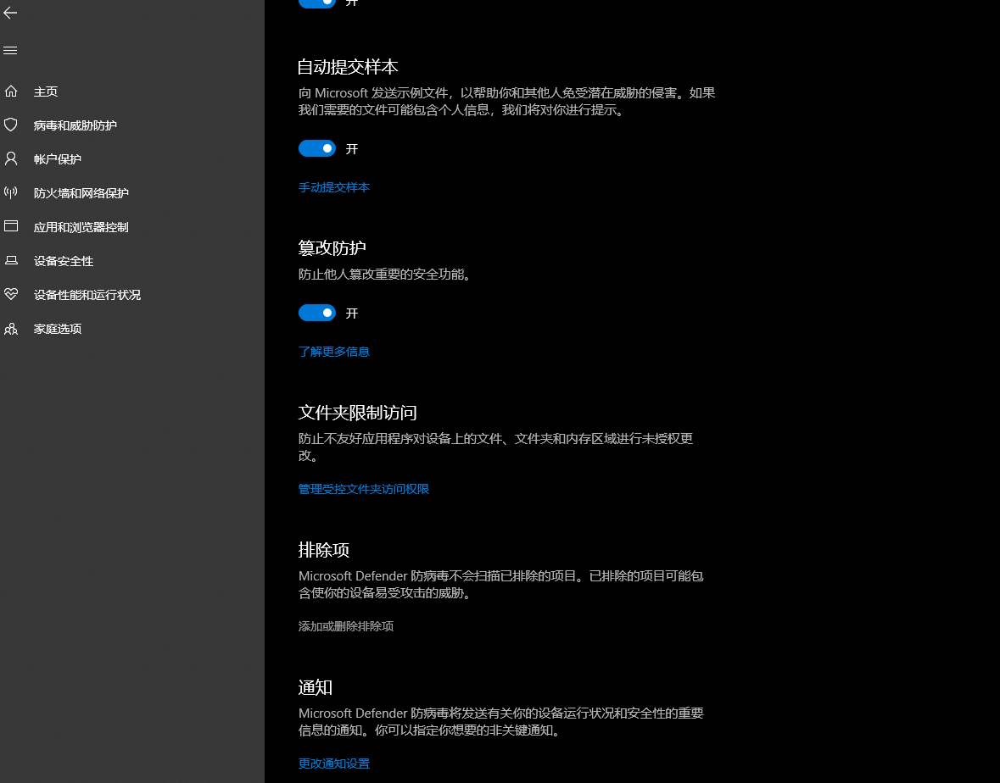

[返回首页](/index.md)

## 为什么windows defender会拦截复仇时刻相关文件？
- 是误报，在官方途径下载的复仇时刻完全无毒；可参照下文把复仇时刻的文件加入白名单

## 如何在windows defender中给文件添加白名单？
- 在window开始菜单中点击<kbd>设置</kbd>，在设置页面中找到<kbd>病毒和威胁防护</kbd>  
  
- 找到<kbd>"病毒和威胁防护设置"设置</kbd>项目，点击其下方的<kbd>管理设置</kbd>  
  
  
- 接着，找到<kbd>排除项</kbd>项目，点击其下方的<kbd>添加或删除排除项</kbd>  
  
然后点击<kbd>添加排除项</kbd> 按钮，即可将误报的文件添加进windows defender的白名单中

[返回目录](/QuestionNAnswer/index.md#anti-virus-software-problem)

