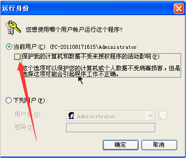
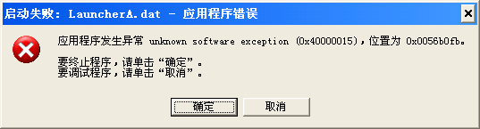

[返回首页](/index.md)

***

* 复仇时刻现在理论上仍然兼容Windows XP系统，但是XP系统用户极有可能因为硬件处理能力太弱而无法支持正常的游戏体验，建议更换系统或者换一台新电脑来游玩复仇时刻。

* 我们不再特意为XP系统用户排查问题，如果出现了疑难解答没收录的错误的话，可以通过在线搜索引擎（baidu、bing等）寻找解决方法，此处不再继续收集解决方法。

* 以下为正常XP系统启动游戏的一些指引
  
  
  
  - 若出现这种情况，取消掉箭头指向的方框中的√即可
  
  
  
  - 类似于这种错误请自行上网搜索，应用程序错误属于XP的特殊情况

***
[返回目录](/QuestionNAnswer/index.md#gaming-problem)
