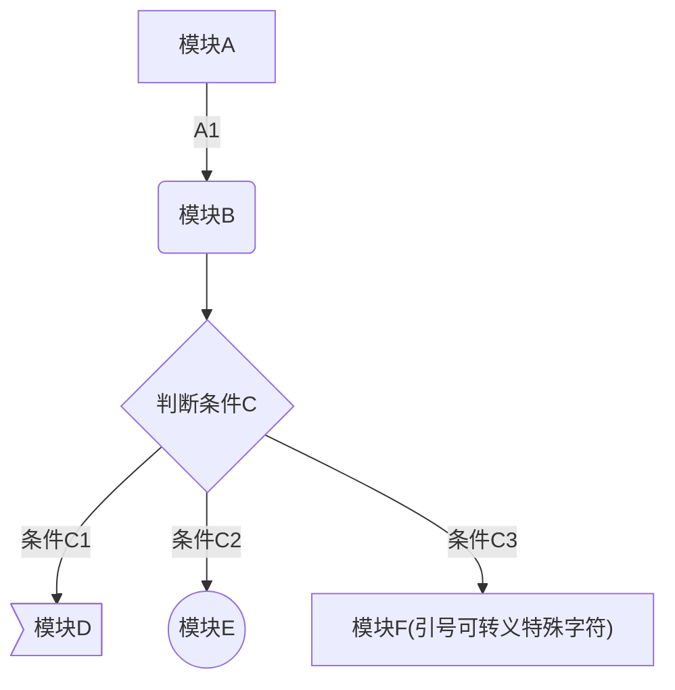

箭头形状 | MarkDown
 :-: | - 
$\uparrow$ | \$\uparrow$
$\Uparrow$ | \$\Uparrow$
$\downarrow$ | \$\downarrow$
$\Downarrow$ | \$\Downarrow$
$\leftarrow$ | \$\leftarrow$
$\Leftarrow$ | \$\Leftarrow$
$\rightarrow$ | \$\rightarrow$
$\Rightarrow$ | \$\Rightarrow$
$\updownarrow$ | \$\updownarrow$
$\Updownarrow$ | \$\Updownarrow$
$\leftrightarrow$ | \$\leftrightarrow$
$\Leftrightarrow$ | \$\Leftrightarrow$